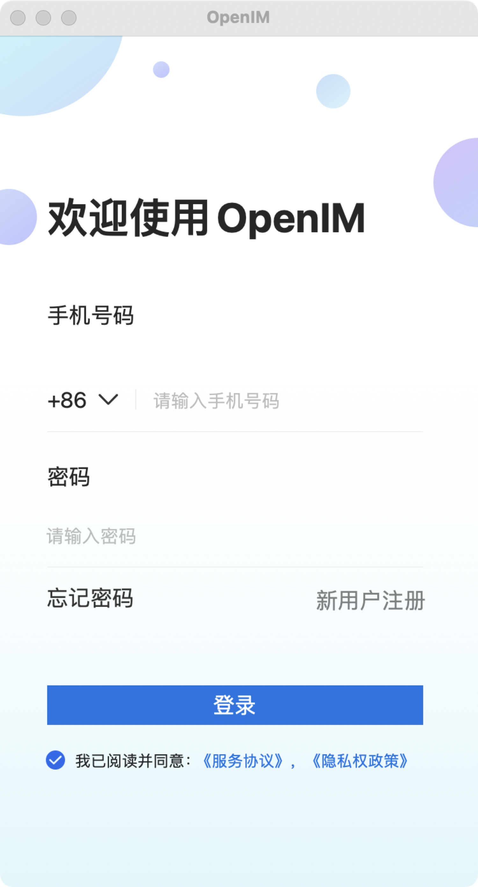
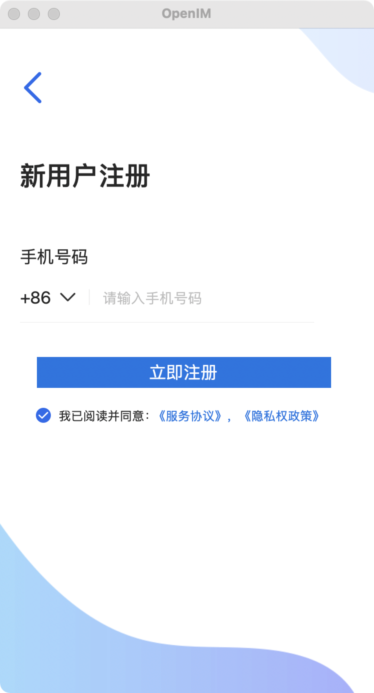
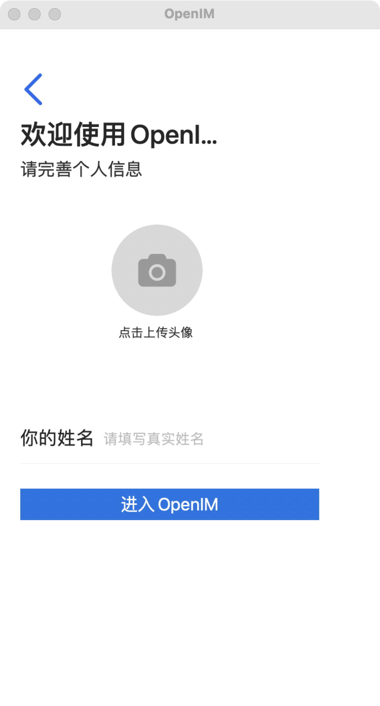

# EEChat: OpenIM Messaging Client for iOS

iOS client for [OpenIM](https://github.com/OpenIMSDK/Open-IM-Server) in Swift.

Status: beta. Usable and mostly stable but bugs may happen.

## Features

### Completed

* Login
* Register new accounts.
* Start new chats.
* Edit personal details.
* Edit chat parameters.
* View the list of active chats
* Send and receive plain text messages one-on-one or in group chats.
* In-app presence notifications.
* Unread message counters.
* Local data persistence.
* Transport Level Security - https/wss.
* Viewing attachments and inline images.
* Delivery and received/read indicators for messages (little check marks in messages).
* Muting/un-muting conversations and other permission management.
* Push notifications.
* Attachments and inline images.
* Group chats.

### Not Done Yet

* Previews not generated for videos, audio, links or docs.
* Typing indicators.
* No support for switching between multiple backends.
* Mentions, hashtags.
* Replying or forwarding messages.
* End-to-End encryption.

## Screenshots

